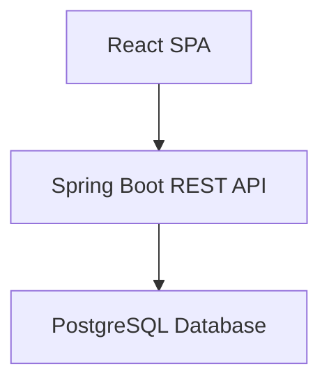
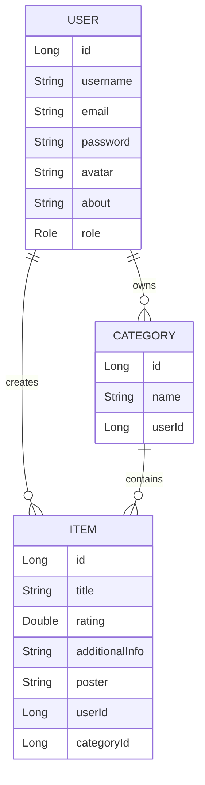
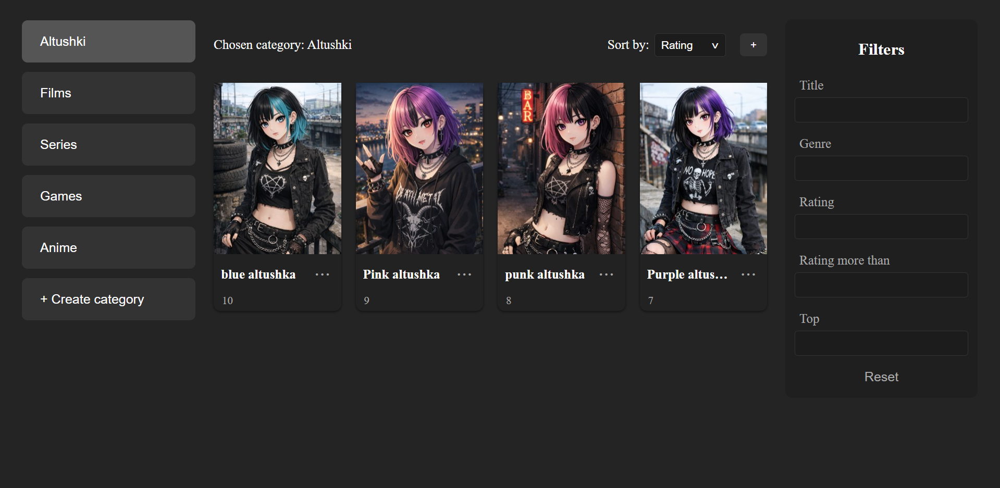
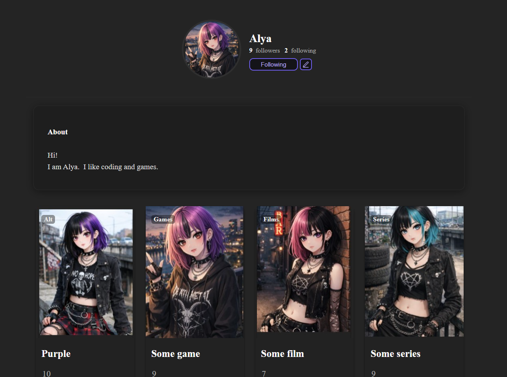
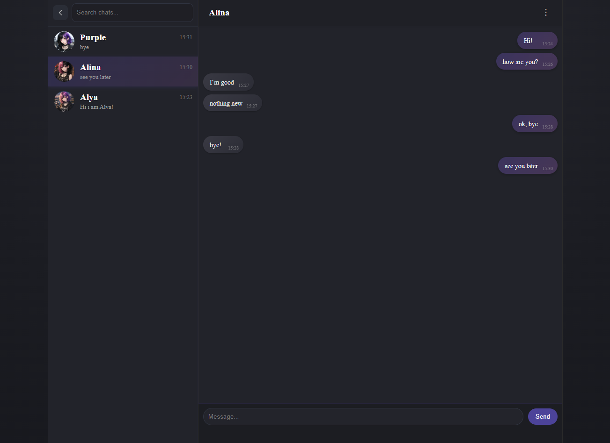
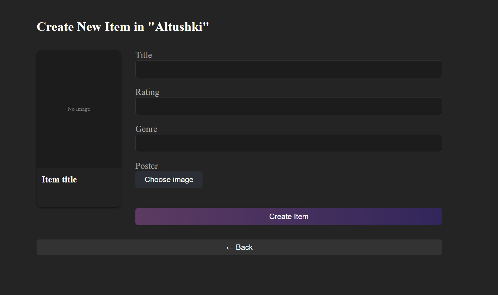
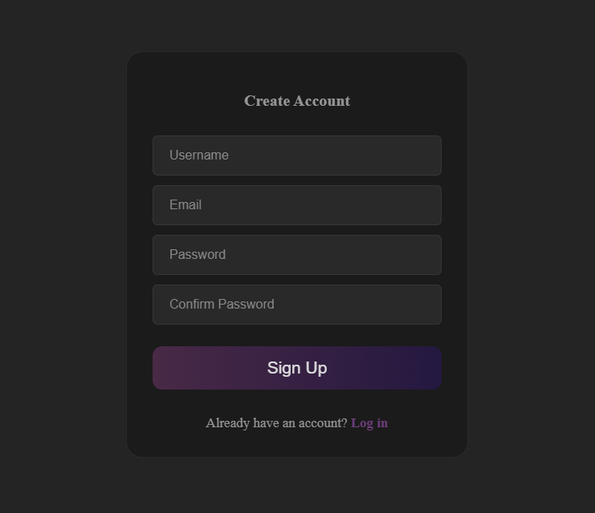
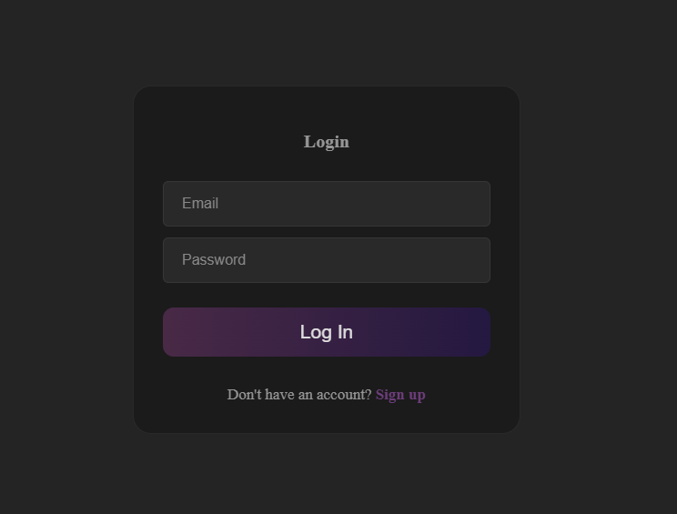

# Mita

## 📚 Mita

Full-stack Library Management System with role-based access control and JWT authentication.
Built with Spring Boot and React.

## 📖 Table of Contents
- [About The Project](#-about-the-project)
- [Features](#-features)
- [Tech Stack](#-tech-stack)
- [Security](#-security)
- [Architecture](#-architecture)
- [Database Architecture](#-database-architecture)
- [REST API Structure](#-rest-api-structure)
- [Screenshots](#-how-it-looks)
- [How to Run](#-how-to-run)

Please note: This repository contains only the back-end part of the application.


## 🚀 About The Project

Mita is a full-stack web application that combines a digital library system with social networking features.

Users can manage items and categories, build personal collections, and communicate through profiles and real-time chat.


## ✨ Features

👤 **User**

- Registration & Login

- Full CRUD for categories

- Full CRUD for items

- Quick item search and filtering

- Various item sorting options

- Real-time chat with other users

- User profiles with editable information

- View other users profiles and activity


👑 **Admin**

- Access to admin dashboard

- Manage all users
  
- Role-based access control (ADMIN / USER)


## 🛠 Tech Stack

**Backend**

- Java 21

- Spring Boot

- Spring Data

- Spring Security

- WebSocket

- JWT

- REST API

- PostgreSQL

**Frontend**

- React

- Fetch API

- Automatic token refresh

- Protected routes

- SPA architecture

## 🔐 Security

- Stateless authentication using JWT

- Access token + Refresh token mechanism

- Automatic access token refresh on expiration

- Role-based authorization

- Custom JwtAuthenticationFilter

- Protected REST endpoints

- Admin-only API routes (/api/admin/**)

## 🏗 Architecture

The application follows a classic client-server architecture:


## 🗄 Database Architecture

There is three main tables in database

Note: The database schema is continuously evolving and may be updated as the project develops.




## 📡 REST API Structure
Note: The REST API is currently under active development and endpoints may be updated or extended.


🔑 Auth Endpoints

| Method | Endpoint           | Description          |
| ------ | ------------------ | -------------------- |
| POST   | /api/auth/register | Register user        |
| POST   | /api/auth/authenticate    | Login         |
| POST   | /api/auth/refresh  | Refresh access token |
| POST   | /api/auth/logout  | Logout |

👤 User Endpoints

| Method | Endpoint           | Access        | Description      |
| ------ | ------------------ | ------------- | -------------    |
| GET    | /api/users/profile | Authenticated | Get user info    |
| PUT    | /api/users/avatar | Authenticated |  Update avatar    |
| PUT    | /api/users/about | Authenticated | Update about block |
| PUT    | /api/users/name | Authenticated |  Update name        |
| GET    | /api/users/stats | Authenticated | Get user stats     |

📂 Category Endpoints

| Method | Endpoint             | Access        | Description      |
| ------ | -------------------- | ------------- | -------------    |
| GET    | /api/categories      | Authenticated | Get categories    |
| GET    | /api/categories/{id} | Authenticated | Get category by id |
| POST   | /api/categories      | Authenticated | Add category    |
| PUT    | /api/categories/{id} | Authenticated | Update category  |
| DELETE | /api/categories/{id} | Authenticated | Delete category  |

📦 Item Endpoints

| Method | Endpoint        | Access        | Description      |
| ------ | --------------- | ------------- | -------------    |
| GET    | /api/items      | Authenticated | Get items with filtration and sorting   |
| GET    | /api/items/{id} | Authenticated | Get item by id   |
| POST   | /api/items      | Authenticated | Add item         |
| PUT    | /api/items/{id} | Authenticated | Update item      |
| DELETE | /api/items/{id} | Authenticated | Delete item      |

👑 Admin Endpoints

| Method | Endpoint              | Access | Description             |
| ------ | --------------------- | ------ | -------------           |
| GET    | /api/admin/user-by-email | ADMIN  | Get user by email    |
| DELETE | /api/admin/user-by-email | ADMIN  | Delete user by email |


## 🔍 How it looks

**Main page have several blocks:**

- Categories list
- Items list
- Filter bar
- Hidden navigation bar

<p align="center">
  
</p>

**Profile page:**

- Avatar and name
- Followers and followings
- About block
- Best items for each category
- Logout button

<p align="center">
  
</p>

**Chat page:**

- List of chats
- Search chats
- Chat
- Back button

<p align="center">
  
</p>

**Add item page:**

- Input fields
- Preview card
- Submit button
- Cancel button

<p align="center">
  
</p>

**Registration page:**

<p align="center">
  
</p>

**Login page:**

<p align="center">
  
</p>

## 🚀 How to Run
**Backend**

```code
mvn spring-boot:run
```

**Runs on:**

```code
http://localhost:8080
```


